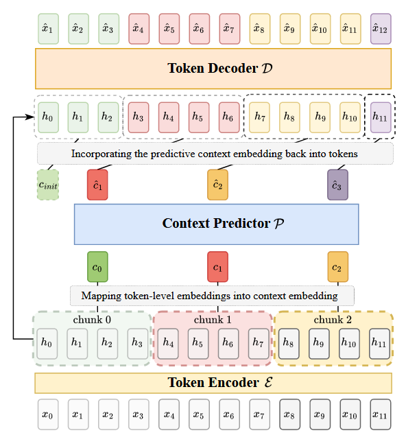
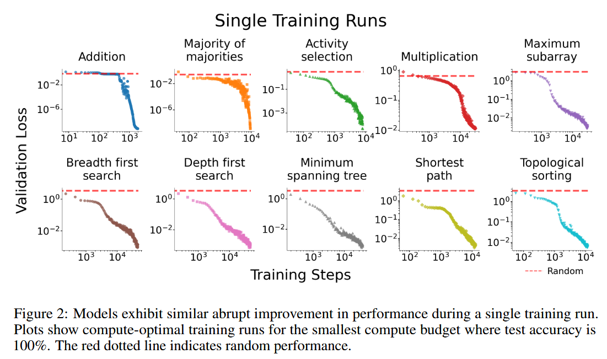
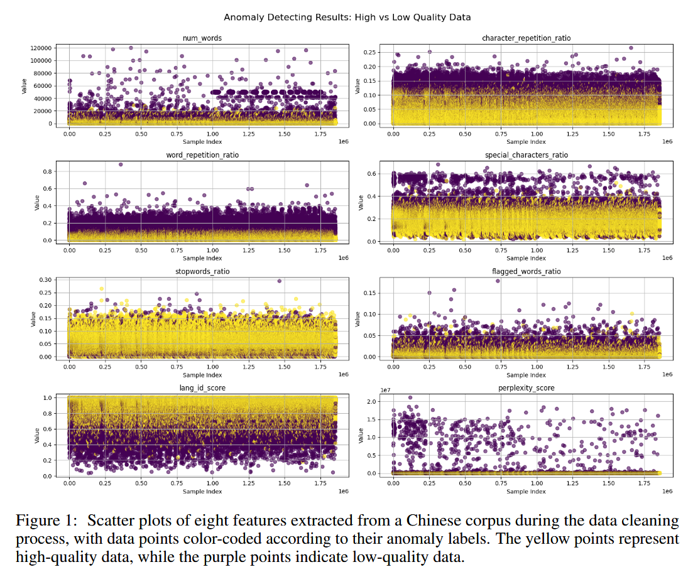

# Papers I read

## LLM
- Through the Valley: Path to Effective Long CoT Training for Small Language Models
    - Renjie Luo, Jiaxi Li, Chen Huang, Wei Lu
    - StatNLP Group; SUTD
    - reasoning traces lead to performance drop first before recovery
        - 
    - length of response decrease as more examples are seen
        - model learns more than superficial copying
    - using reasoning traces for cold start is good but enough SFT needs to be done
        - 

- Long-Short Alignment for Effective Long-Context Modeling in LLMs
    - Tianqi Du, Haotian Huang, Yifei Wang, Yisen Wang
    - State Key Lab of General AI, Peking University; NUS; MIT CSAIL; Institute for AI, Peking University
    - Idea: Modify Output space of model
    - long-short misalignment
        - new metric to measure differences in output entropy
        - symmetrical cross-entropy between different truncations of a long input
            - ? but the truncated info might be relevant?
            - used as a generalization technique so maybe it's ok in the general case?
        - uses a cute packing method to more optimally compute the loss
            - seq = 0-a-b-end
            - s1 = 0-b
            - s2 = a-end
            - misalignment loss computed at position b
    - this mtd improves close context while not seeming to lead to performance degradation for referring to distant context
        - 

- Contrastive Decoding for Synthetic Data Generation in Low-Resource Language Modeling
    - Jannek Ulm, Kevin Du, Vésteinn Snæbjarnarson
    - ETH Zürich, University of Copenhagen
    - contrastive decoding defines a probabilty distribution defined by the differences between a good and a bad model
    - use CD when downstream targets emphasize multi-step inference, state maintenance, or world knowledge; use vanilla sampling when the objective is to minimize perplexity or to improve core grammaticality.

- Pretraining LLM with Latent Thoughts in Continuous Space
    - Boyi Zeng, He Li, Shixiang Song, Yixuan Wang, Ziwei He, Xinbing Wang, Zhouhan Lin
    - LUMIA Lab, Shanghai Jiao Tong University, Shanghai AI Lab, Shanghai Innovation Institute
    - Adds one intermediate token between each token that is unconstrained (continuous)
        - 
    - training requires finding a fixed-point operator to parallelize
        - 
        - one normal forward pass to produce hidden states for all tokens
        - interleave hidden states
        - do forward pass a few more time to approach true hidden state
        - expts show converge before 5 passes
        - they used randomly chosen {2,3,4} passes
        - back-propagation through time? seems to be skipped? so the hidden states are not directly optimized for
    - hidden states inherit the same positional embeddings as original token
    - oh works for CPT too!

- Alif: Advancing Urdu Large Language Models via Multilingual Synthetic Data Distillation
    - Muhammad Ali Shafique, Kanwal Mehreen, Muhammad Arham, Maaz Amjad, Sabur Butt, Hamza Farooq
    - Traversaal.ai, University of British Columbia, Texas Tech University, Institute for the Future of Education, Tecnológico de Monterrey
    - Details a way of creating an instruct dataset in a low-resource language
        - 7 tasks: generation, ethics, qa, reasoning, translation, classification, sentiment-analysis
        - unique prompts+seeds for each task
        - collect all generated prompts into a global task pool
        - each prompt is augmented with 4 human-annotated seed values and 2 machine generated ones:
            - GPT-4o is then used to generate 20 instructions and corresponding outputs
        - filtering:
            - filter instructions <3 and >150 words
            - filter problematic keywords
            - filter non-en and non-urdu characters
            - filter instructions >0.7 rouge similar to selected instructions
            - final human filtering
    - [Code](https://github.com/traversaal-ai/alif-urdu-llm)
        - contains prompts and seeds
    - [urdu-instruct dataset](https://huggingface.co/datasets/large-traversaal/urdu-instruct)
        - urdu-native COT reasoning
    - uses LoRA on QKVO, MLP, embed/output layers

- Context-level Language Modeling by Learning Predictive Context Embeddings
    - Beiya Dai, Yuliang Liu, Daozheng Xue, Qipeng Guo, Kai Chen, Xinbing Wang, Bowen Zhou, Zhouhan Lin
    - LUMIA Lab, Shanghai Jiao Tong University, Shanghai AI Laboratory, Tsinghua University, Nanjing University
    - Defines a Context Predictor
        - encode preceding tokens into context embeddings
        - autoregressively forecast the next context embedding
        - fuse the predictive context back into token-level decoding process
    - 
    - is better results just because of more parameters?
        - seems to be ok, cos the extra tokens are 'stolen' from the normal part of the model
    - uses a fixed chunk size `w`
        - smaller chunk size gives better perplexity
        - did not show ablation results for long context results with different 'w'
    - 2 layer decoder only architecture seems best

- A Rigorous Evaluation of LLM Data Generation Strategies for Low-Resource Languages
    - Tatiana Anikina, Jan Cegin, Jakub Simko, Simon Ostermann
    - German Research Institute for Artificial Intelligence (DFKI), Brno University of Technology, Kempelen Institute of Intelligent Technologies
    - conducted experiments regarding sythetic task-specific data generation
    - 3 methods
        - summarized labels
        - demonstration
        - revision
    - using target language demonstrations together with LLM-based revision is the best

- Quiet Feature Learning in Algorithmic Tasks
    - Prudhviraj Naidu, Zixian Wang, Leon Bergen, Ramamohan Paturi
    - UC San Diego
    - validation loss barely moves, then abruptly decreases
    - "averaging" many different tasks hide abrupt transitions for each task
    - 2 phases of learning
        - slow phase, no/minimal changes in val loss
        - fast phase, sharp drop in loss
    - quiet features (impt for task) are learnt in slow phase
    - expts conducted on 10 algorithmic tasks
    - 
    - ablations show that quiet features are impt for task performance
    - models trained seem to be small
    - author's discussion: does complex language models show similar issues?

- DCAD-2000: A Multilingual Dataset across 2000+ Languages with Data Cleaning as Anomaly Detection
    - Yingli Shen， Wen Lai， Shuo Wang， Xueren Zhang， Kangyang Luo， Alexander Fraser， Maosong Sun
    - Tsinghua University, Technical University of Munich
    - Use anomaly detection to filter for bad examples
    - 8 features: number of words, character/word repetition ratio, special character/word ratio, stopword ratio, flagged words ratio, language identification score and perplexity score (KenLM)
    - Tried various anomaly detection algorithms, Isolation Forest performs the best
    - Filtered examples seem to be more discriminative compared to just using thresholds
        - 

- Qwen 2.5 LC
    - increase RoPE base from 10e4 to 10e6
    - staged context extension
    - each stage is 60% of previous length and 40% of new length
    - use YARN and DCA in inference

- YaRN: Efficient Context Window Extension of Large Language Models
    - Bowen Peng, Jeffrey Quesnelle, Honglu Fan, Enrico Shippole
    - Nous Research, EleutherAI, Enrico Shippole
    - general form of RoPE function
        - $f'_\bold{w}(x_m, g(m), h(\theta_d))$
    - position interpolation
        - $g(m) = m/s$; $h(\theta_d)) = \theta_d$
    - NTK-aware
        - $g(m) = m$; $h(\theta_d)) = b'^{\frac{-2d}{|D|}}$; $b' = b\cdot s^{\frac{|D|}{|D|-2}}$
    - NTK-by-parts
        - consider high freq and low freq terms differently
        - high freq == short wave-length => don't change
            - mostly relative positions
        - low freq == long wave-length => do PI
            - mostly absolute positions
        - $L$ is original context size
        - define ramp function: $r(d) = \frac{L}{2\pi b'^{\frac{2d}{|D|}}}$
        - define $\alpha$ and $\beta$, below $\alpha$, we do PI, above $\beta$, we don't do anything
        - interpolate in between
        - $\gamma(r) = \begin{cases}0, & r < \alpha \\ 1, & r > \beta \\ \frac{r-\alpha}{\beta-\alpha}, & \text{otherwise.} \\ \end{cases}$
        - $g(m) = m$; $h(\theta_d)) = \left(1-\gamma \left(r(d) \right)\right)\frac{\theta_d}{s} + \gamma \left(r(d)\right)\theta_d$
    - Dynamic NTK
        - automatically update the scaling factor
    - YaRN
        - takes NTK-by-parts and also scale attn computation by $1/\sqrt{t}$
        - the scaling can be put into the rope computation

- ACORD: An Expert-Annotated Dataset for Legal Contract Clause Retrieval
    - Steven H. Wang, Maksim Zubkov, Kexin Fan, Sarah Harrell, Yuyang Sun, Wei Chen, Andreas Plesner, Roger Wattenhofer
    - ETH Zurich, NYU, University of Washington, Yale University, The Atticus Project
    - introduces the [Atticus Clause Retrieval Dataset (ACORD)](https://huggingface.co/datasets/theatticusproject/acord)
    -

## Chem
- An evaluation methodology for machine learning-based tandem mass spectra similarity prediction
    - Michael Strobel, Alberto Gil-de-la-Fuente, Mohammad Reza Zare Shahneh, Yasin El Abiead, Roman Bushuiev, Anton Bushuiev, Tomáš Pluskal, Mingxun Wang
    - UC Riverside, Universidad CEU San Pablo, UC San Diego, IOCB Prague, Czech Institute of Informatics, Robotics and Cybernetics
    - [harmonized MC/MC datasets (LC? / GC?)](https://external.gnps2.org/gnpslibrary)
        - 189,467 spectra from 28,132 structures

- NMR-Solver: Automated Structure Elucidation via Large-Scale Spectral Matching and Physics-Guided Fragment Optimization
    -  Yongqi Jin, Jun-Jie Wang, Fanjie Xu, Xiaohong Ji, Zhifeng Gao, Linfeng Zhang, Guolin Ke, Rong Zhu, Weinan E
    - Peking University, DP Technology, Xiamen University, AI for Science Institute
    - four modules
        - molecular optimization
        - forward prediction (NMR-Net)
        - database retrieval
        - scenario adaptation
    - Model Architecture
        - 
    - C-F coupling is weird in simulated NMR
    - NMR Comparison
        - vector similarity
            - gaussian convolution + 128 uniformly spaced spots
        - set similarity
            - optimal bipartite matching
            - `linear_sum_assignment` in `scipy.optimize`
    - Fragment-NMR-Based Molecular Optimization
        - 
        - estimates chemical shifts of new molecules from parent molecules (shifts are mostly local effects)
        - candidate selection is a 3 step process
            - fast vector-based top-k complementary fragments
            - candidates pairs are aggregated and re-ranked
            - refined using set-similarity
        - newly generated molecules then undergo the fwd model to get new simulated spectra

- An Integrated Method for Spectrum Extraction and Compound Identification from Gas Chromatography/Mass Spectrometry Data
    - S. E. Stein
    - NIST Hybrid Matching Algorithm
    - scaled normalized dot product of spectra
    - $100\frac{(\sum wm[A_uA_r]^{1/2})^2}{\sum A_um \sum A_rm}$
    - w is a weighting for uncertain peaks (adapt to prediction scores?)
    - corrections
        - correct for spectra with very few predicted peaks
            - $1/(1+wA)$
            - $w=1/(a+\sum{A-1})$
        - adjacent peak deconvolution (not needed in cleaned spectra)
            - penalty of 2 for explicit overlapping component
        - component purity
            - $1.0 \log_{10}(purity) + 0.6$
        - detection threshold
            - $(1-threshold)^{0.3}$

- A New Matching Algorithm for High Resolution Mass Spectra
    - Michael Edberg Hansen, Jørn Smedsgaard
    - Technical University of Denmark
    - based on Jeffreys-Matusitas (JM) distance
    - hypothesis 1: each peak can match with at most 1 peak
    - automatic peak matching using the following:
        - 
    - AMS Distance
        - $$d_{U \mapsto R} = \frac{w_0}{L} \sum_{\{q_l, p_l\} \in \Lambda} w \left( \phi^U_{q_l}, \phi^R_{p_l}\right) \cdot d_{q_j, p_l}$$
