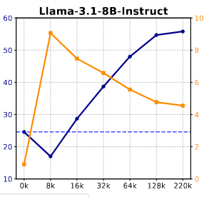
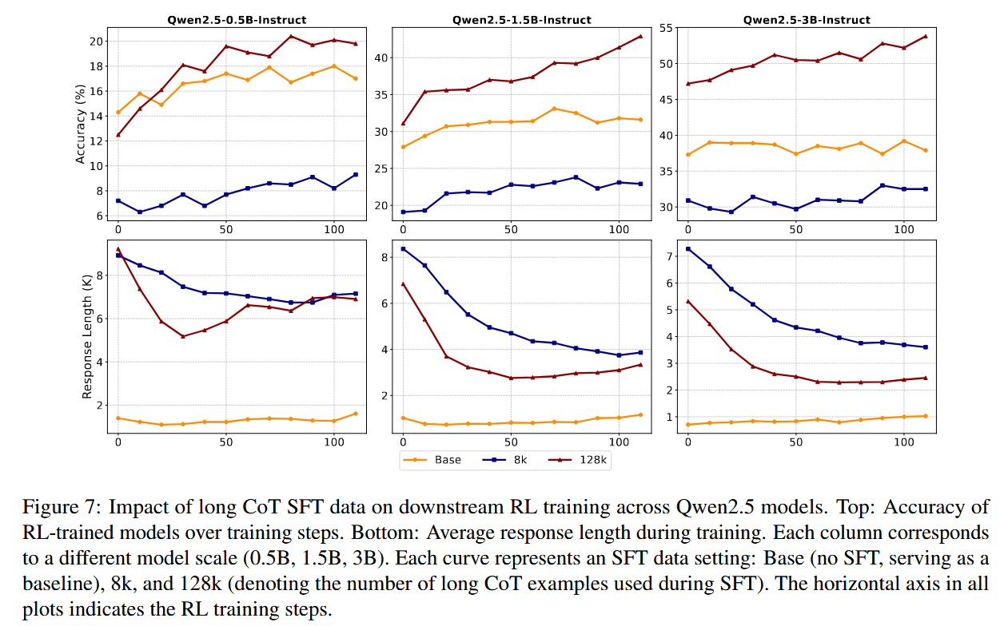
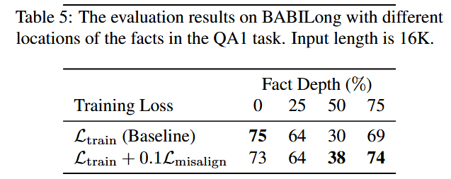
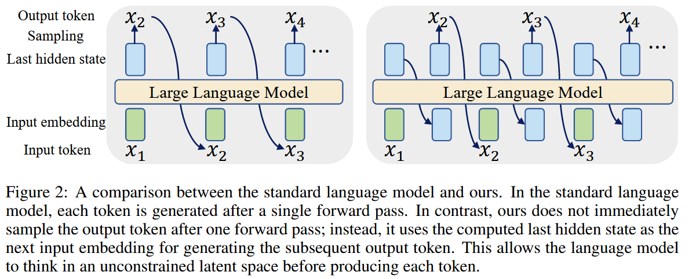
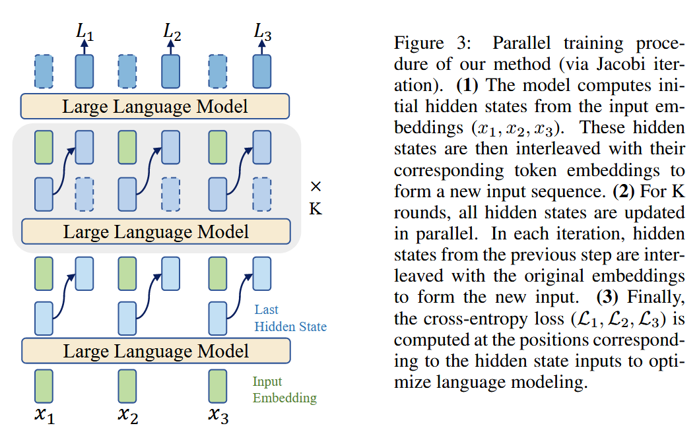
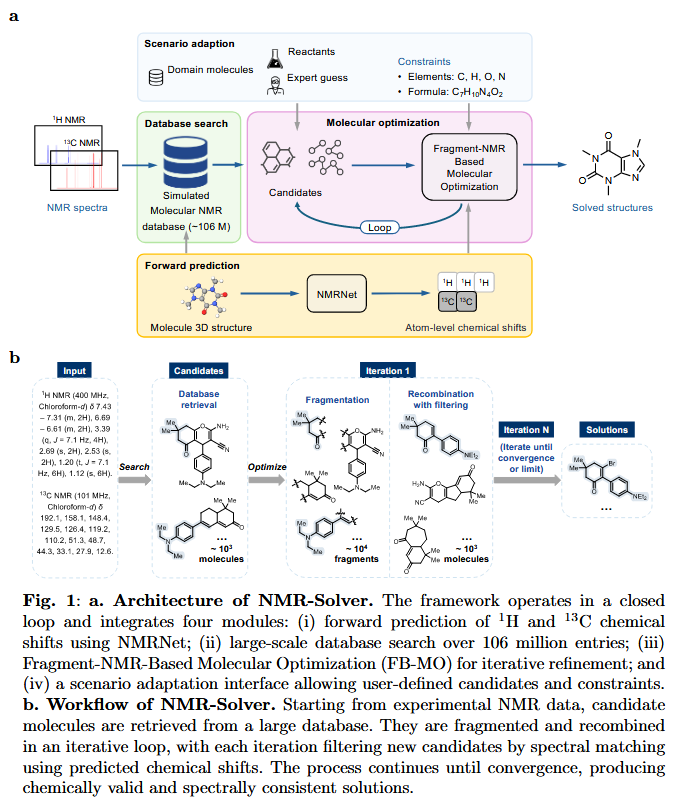
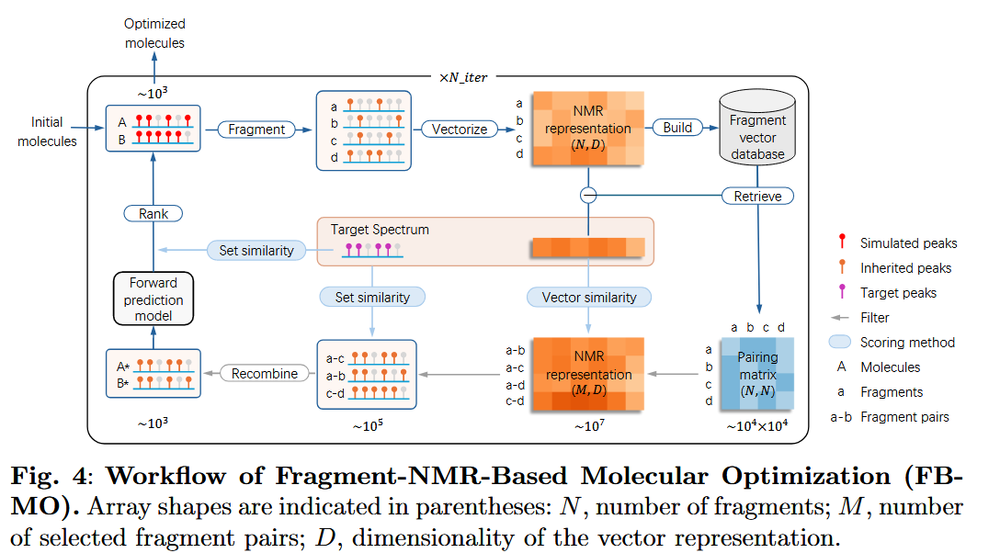
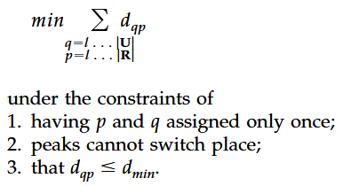

# Papers I read

## LLM
- Through the Valley: Path to Effective Long CoT Training for Small Language Models
    - Renjie Luo, Jiaxi Li, Chen Huang, Wei Lu
    - StatNLP Group; SUTD
    - reasoning traces lead to performance drop first before recovery
        - 
    - length of response decrease as more examples are seen
        - model learns more than superficial copying
    - using reasoning traces for cold start is good but enough SFT needs to be done
        - 

- Long-Short Alignment for Effective Long-Context Modeling in LLMs
    - Tianqi Du, Haotian Huang, Yifei Wang, Yisen Wang
    - State Key Lab of General AI, Peking University; NUS; MIT CSAIL; Institute for AI, Peking University
    - Idea: Modify Output space of model
    - long-short misalignment
        - new metric to measure differences in output entropy
        - symmetrical cross-entropy between different truncations of a long input
            - ? but the truncated info might be relevant?
            - used as a generalization technique so maybe it's ok in the general case?
        - uses a cute packing method to more optimally compute the loss
            - seq = 0-a-b-end
            - s1 = 0-b
            - s2 = a-end
            - misalignment loss computed at position b
    - this mtd improves close context while not seeming to lead to performance degradation for referring to distant context
        - 

- Contrastive Decoding for Synthetic Data Generation in Low-Resource Language Modeling
    - Jannek Ulm, Kevin Du, Vésteinn Snæbjarnarson
    - ETH Zürich, University of Copenhagen
    - contrastive decoding defines a probabilty distribution defined by the differences between a good and a bad model
    - use CD when downstream targets emphasize multi-step inference, state maintenance, or world knowledge; use vanilla sampling when the objective is to minimize perplexity or to improve core grammaticality.

- Pretraining LLM with Latent Thoughts in Continuous Space
    - Boyi Zeng, He Li, Shixiang Song, Yixuan Wang, Ziwei He, Xinbing Wang, Zhouhan Lin
    - LUMIA Lab, Shanghai Jiao Tong University, Shanghai AI Lab, Shanghai Innovation Institute
    - Adds one intermediate token between each token that is unconstrained (continuous)
        - 
    - training requires finding a fixed-point operator to parallelize
        - 
        - one normal forward pass to produce hidden states for all tokens
        - interleave hidden states
        - do forward pass a few more time to approach true hidden state
        - expts show converge before 5 passes
        - they used randomly chosen {2,3,4} passes
        - back-propagation through time? seems to be skipped? so the hidden states are not directly optimized for
    - hidden states inherit the same positional embeddings as original token
    - oh works for CPT too!

## Chem
- An evaluation methodology for machine learning-based tandem mass spectra similarity prediction
    - Michael Strobel, Alberto Gil-de-la-Fuente, Mohammad Reza Zare Shahneh, Yasin El Abiead, Roman Bushuiev, Anton Bushuiev, Tomáš Pluskal, Mingxun Wang
    - UC Riverside, Universidad CEU San Pablo, UC San Diego, IOCB Prague, Czech Institute of Informatics, Robotics and Cybernetics
    - [harmonized MC/MC datasets (LC? / GC?)](https://external.gnps2.org/gnpslibrary)
        - 189,467 spectra from 28,132 structures

- NMR-Solver: Automated Structure Elucidation via Large-Scale Spectral Matching and Physics-Guided Fragment Optimization
    -  Yongqi Jin, Jun-Jie Wang, Fanjie Xu, Xiaohong Ji, Zhifeng Gao, Linfeng Zhang, Guolin Ke, Rong Zhu, Weinan E
    - Peking University, DP Technology, Xiamen University, AI for Science Institute
    - four modules
        - molecular optimization
        - forward prediction (NMR-Net)
        - database retrieval
        - scenario adaptation
    - Model Architecture
        - 
    - C-F coupling is weird in simulated NMR
    - NMR Comparison
        - vector similarity
            - gaussian convolution + 128 uniformly spaced spots
        - set similarity
            - optimal bipartite matching
            - `linear_sum_assignment` in `scipy.optimize`
    - Fragment-NMR-Based Molecular Optimization
        - 
        - estimates chemical shifts of new molecules from parent molecules (shifts are mostly local effects)
        - candidate selection is a 3 step process
            - fast vector-based top-k complementary fragments
            - candidates pairs are aggregated and re-ranked
            - refined using set-similarity
        - newly generated molecules then undergo the fwd model to get new simulated spectra

- An Integrated Method for Spectrum Extraction and Compound Identification from Gas Chromatography/Mass Spectrometry Data
    - S. E. Stein
    - NIST Hybrid Matching Algorithm
    - scaled normalized dot product of spectra
    - $100\frac{(\sum wm[A_uA_r]^{1/2})^2}{\sum A_um \sum A_rm}$
    - w is a weighting for uncertain peaks (adapt to prediction scores?)
    - corrections
        - correct for spectra with very few predicted peaks
            - $1/(1+wA)$
            - $w=1/(a+\sum{A-1})$
        - adjacent peak deconvolution (not needed in cleaned spectra)
            - penalty of 2 for explicit overlapping component
        - component purity
            - $1.0 \log_{10}(purity) + 0.6$
        - detection threshold
            - $(1-threshold)^{0.3}$

- A New Matching Algorithm for High Resolution Mass Spectra
    - Michael Edberg Hansen, Jørn Smedsgaard
    - Technical University of Denmark
    - based on Jeffreys-Matusitas (JM) distance
    - hypothesis 1: each peak can match with at most 1 peak
    - automatic peak matching using the following:
        - 
    - AMS Distance
        - $$d_{U \mapsto R} = \frac{w_0}{L} \sum_{\{q_l, p_l\} \in \Lambda} w \left( \phi^U_{q_l}, \phi^R_{p_l}\right) \cdot d_{q_j, p_l}$$
